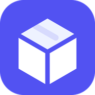

  

# Deployed using Vercel and build by Sydney Mico

This contains everything you need to run your app locally.

View your app in using this link: https://stockmaster-cloud.vercel.app/

## Run Locally

**Prerequisites:**  Node.js

1. Install dependencies:
   `npm install`
2. Set the `GEMINI_API_KEY` in [.env.local](.env.local) to your Gemini API key
3. Run the app:
   `npm run dev`
# StockMaster-Cloud
